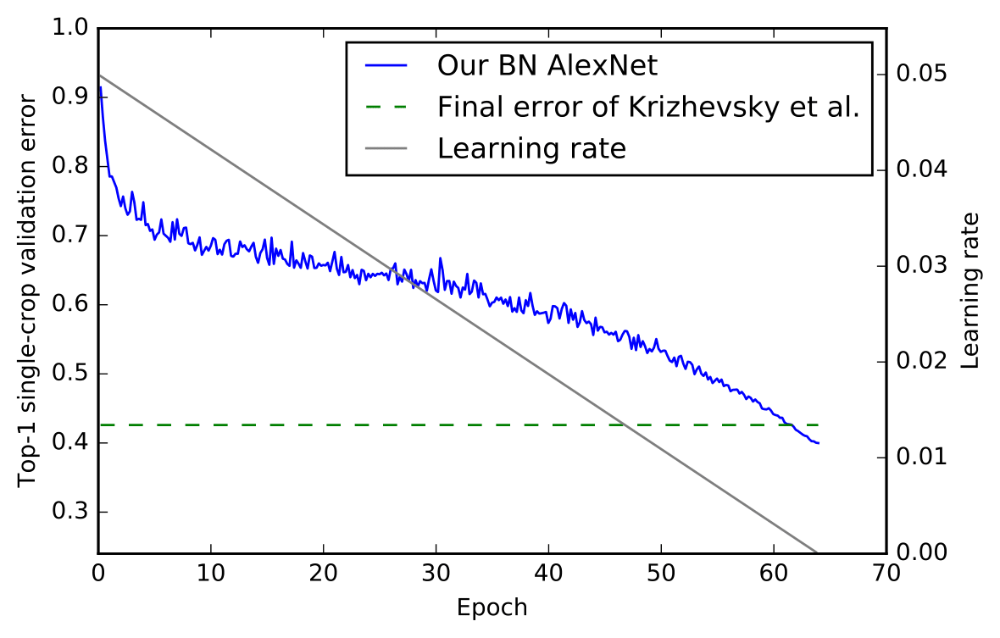
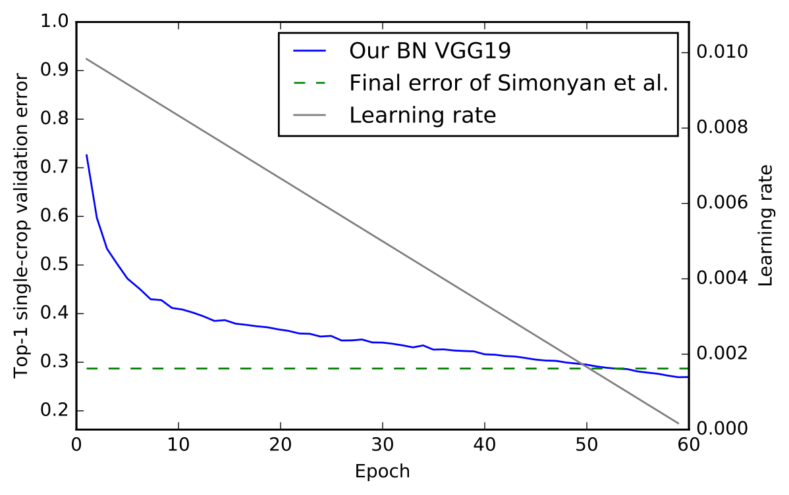
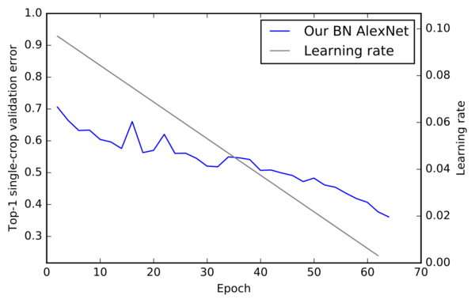

# CNN Models by CVGJ 

## Intro
This repository contains convolutional neural network (CNN) models trained on ImageNet by Marcel Simon at the Computer Vision Group Jena (CVGJ) using the Caffe framework as published in the accompanying [technical report](https://arxiv.org/abs/1612.01452 "ImageNet pre-trained models with batch normalization by Marcel Simon et al on arxiv."). Each model is in a separate subfolder and contains everything needed to reproduce the results. This repository focuses currently contains the batch-normalization-variants of AlexNet and VGG19 as well as the training code for Residual Networks (Resnet). 

## How to use
**No mean subtraction is required** for the pre-trained models! We have a batch-normalization layer which basically does the same. 

The pre-trained models can be obtained by the download link written in `model_download_link.txt`. 

If you want to train on your own dataset, simply execute `caffe train --solver train.solver --gpu 0 2> train.log` to start the training and write the output to the log file `train.log`. Please note, that we pre-scaled all images of the dataset such that the smaller side has a length of 256 pixels while keeping the aspect ratio. You can use `convert input.jpg -resize 256x256^ output.jpg` to convert the images using the command line. 

To evaluate the final model, execute `caffe train --solver test.solver --gpu 0 2> test.log`.


## Accuracy on ImageNet
**Single-crop** error rates on the validation set of the ILSVRC 2012--16 classification task.

| Model            | Top-1 error  (vs. original) |  Top-5 error  (vs. original) |
| ---------------- |-----------------------------|-------------------------------|
| AlexNet_cvgj     | **39.9%** (vs. 42.6%)       | **18.1%**  (vs. 19.6%)
| VGG19_cvgj       | **26.9%** (vs. 28.7%)       | **8.8%**  (vs. 9.9%)
| ResNet10_cvgj    | **36.1%**                   | **14.8%**  
| ResNet50_cvgj    | **24.6%** (vs. 24.7%)       | **7.6%** (vs. 7.8%)


## Citation
Please cite the following [technical report](https://arxiv.org/abs/1612.01452 "ImageNet pre-trained models with batch normalization by Marcel Simon et al on arxiv.") if our models helped your research:

```
@article{simon2016cnnmodels,
  Author = {Simon, Marcel and Rodner, Erik and Denzler, Joachim},
  Journal = {arXiv preprint arXiv:1612.01452},
  Title = {ImageNet pre-trained models with batch normalization},
  Year = {2016}
}
```

The report also contains an overview and analysis of the models shown here.

## Appendix: convergence plots

### AlexNet_cvgj 


### VGG19_cvgj 


### ResNet10_cvgj 


### Further details
Please see the accompanying [technical report](https://arxiv.org/abs/1612.01452 "ImageNet pre-trained models with batch normalization by Marcel Simon et al on arxiv.") for further information about the models and the training procedure:


```
@article{simon2016cnnmodels,
  Author = {Simon, Marcel and Rodner, Erik and Denzler, Joachim},
  Journal = {arXiv preprint arXiv:1612.01452},
  Title = {ImageNet pre-trained models with batch normalization},
  Year = {2016}
}
```

### License and support
The models are released under BSD 2-clause license allowing both academic and commercial use. I would appreciate if you give credit to this work by citing our paper in academic works and referencing to this Github repository in commercial works. If you need any support, please open an issue or contact [Marcel Simon](https://marcelsimon.com/).
